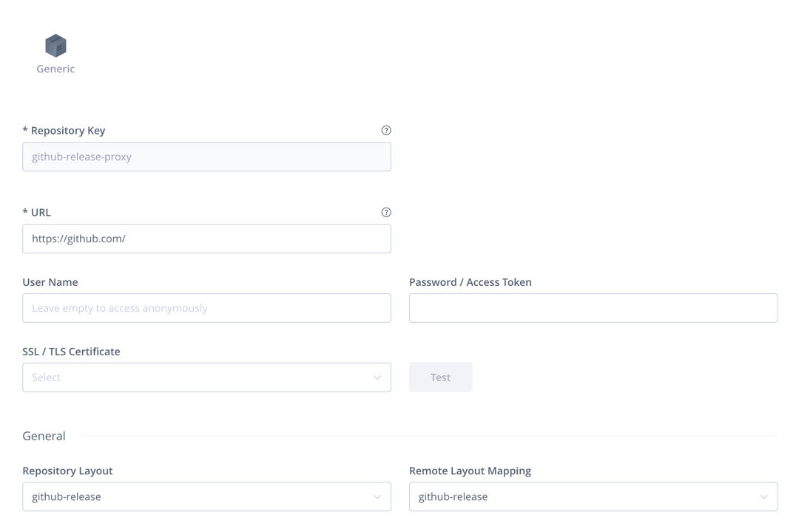
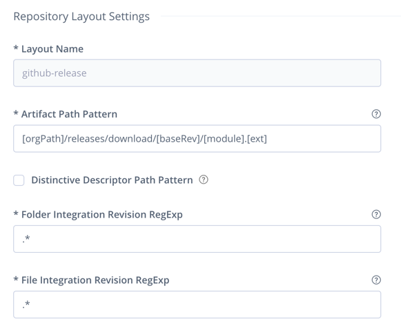
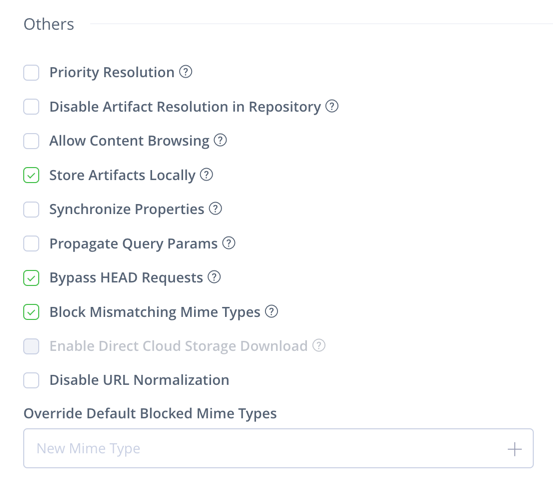

Gradle CLI plugins
==================

About
-----
Many great tools are available as a statically linked executables that one can just download and run. Often this is more
desirable than using docker due to size constraints and performance on macs.

This suit of plugins provides a framework that makes it easy to add support for such tools and implements support for a
few of them. All tools are downloaded as regular Gradle dependencies, so they will be cached locally and benefit from
dependency verification.

In general Linux and OSX are supported on x84_46 and AARCH64.

Usage
-----

```kotlin
cli {
    kind {
        version.set("v1.2.3")
        baseURL.set(java.net.URL("https://artifactory.elastic.dev/artifactory/github-release-proxy"))
        pattern.set("cli/[revision]/[module]-[classifier]")
        // Optional, in case the URL requires authentication  
        username.set("some username")
        password.set("some password")
    }
}
```

Parameters are self-explanatory. The pattern is interpreted as an
[Ivy pattern](https://docs.gradle.org/current/userguide/declaring_repositories.html#sub:defining_custom_pattern_layout_for_an_ivy_repository)
and appended to the base URL to get the tool at a specific version.

The tools are linked to `gradle/bin` and can be used outside Gradle too.

Base URLs default to locations in the elastic Artifactory instance and require credentials to use.


Integrating with the [vault plugin](../vault/README.md)
--------------------------------------------------------

In case of using a caching proxy, e.g. Artifactory to shield from availability issues on the internet, one can use the
vault plugin for the credentials.

```kotlin 
plugins {
   id("co.elastic.vault")
   id("co.elastic.cli.snyk")
}
vault {
      address.set("https://secrets.elastic.co:8200")
      auth {
        ghTokenFile()
        ghTokenEnv()
        tokenEnv()
        roleAndSecretEnv()
      }
}
cli {
    snyk {
       val credentials = vault.readAndCacheSecret("secret/cloud-team/cloud-ci/artifactory_creds").get()
       username.set(credentials["username"])
       password.set(credentials["plaintext"])
    }
}
```

This example will use the default elastic Artifactory instance to access the snyk binary and will get the credentials
for it from vault.

Available tools
----------------

### manifest-tool

```kotlin
import co.elastic.gradle.cli.manifest.ManifestToolExecTask

plugins {
    id("co.elastic.cli.manifest-tool")
}
cli {
    manifestTool {
        // see above for configuration
    }
}

tasks.register<ManifestToolExecTask>("manifestTool") {
    args = listOf("--version")
}
```

The `ManifestToolExecTask` extends the
[Gradle Exec task](https://docs.gradle.org/current/dsl/org.gradle.api.tasks.Exec.html). The plugin configures the task
so the executable is already set, a prefix is added to each line of the output to mark that it's coming from this tool
and the environment is not inherited by default as opposed to the standard exec task.

### snyk

```kotlin
import co.elastic.gradle.snyk.SnykCLIExecTask

plugins {
    id("co.elastic.cli.snyk")
}
cli {
    snyk {
        // see above for configuration
    }
}

tasks.register<SnykCLIExecTask>("manifestTool") {
    args = listOf("--version")
}
```

The `SnykCLIExecTask` extends the
[Gradle Exec task](https://docs.gradle.org/current/dsl/org.gradle.api.tasks.Exec.html). The plugin configures the task
so the executable is already set, a prefix is added to each line of the output to mark that it's coming from this tool
and the environment is not inherited by default as opposed to the standard exec task.

Since snyk is not hosted on GitHub it can also be used without Artifactory:

```kotlin
import co.elastic.gradle.snyk.SnykCLIExecTask

plugins {
    id("co.elastic.cli.snyk")
}
cli {
    snyk {
        baseURL.set(java.net.URL("https://static.snyk.io/"))
    }
}

tasks.register<SnykCLIExecTask>("snyk") {
    args = listOf("--version")
}
```

The Snyk token as well as additional parameters can be set trough environmental variables, here's how to set the token
using the [Vault Plugin](../vault/README.md):

```kotlin
import co.elastic.gradle.snyk.SnykCLIExecTask

tasks.withType<SnykCLIExecTask> {
    environment(
        "SNYK_TOKEN",
        vault.readAndCacheSecret("secret/cloud-team/cloud-ci/snyk_api_key").get()["plaintext"].toString()
    )
}
```

### shellcheck

```kotlin
plugins {
    id("co.elastic.cli.shellcheck")
}
cli {
    shellcheck {
        // see above for configuration
    }
}
tasks.shellcheck {
    check(files("sample.sh"))
}
```

Unlike the previous two, the shellcheck plugin creates a `ShellcheckTask` task to run the tool which does not extend
`Exec` but instead wraps the `shellcheck` task to properly declare inputs and outputs and enable caching.

The plugin registers a `shellcheck` and adds it as a dependency to the check [lifecycle](../lifecycle/README.md),
including the multi architecture version. This task will automatically check any files matching `src/**/*.sh`.
The `check` method can be used to add additional `FileCollection`s to be checked (e.g. `files(...)` or `fileTree(...)`).

Additional `ShellcheckTask` tasks can be created and the plugin will configure them to work with the provisioned
executable.

Limitations
-----------

### GitHub Releases require a proxy

At the time of this writing, GitHub releases does not support `HEAD` requests that Gradle would require to be able to
download the binaries.

One way to make this work is to use a caching proxy that can answer the `HEAD` requests based on it's cache.

Artifactory supports this setup via a generic remote repository, with a custom layout:



And the layout:



The "Bypass HEAD Requests" option is the one we want and is present on the advanced options tab:


